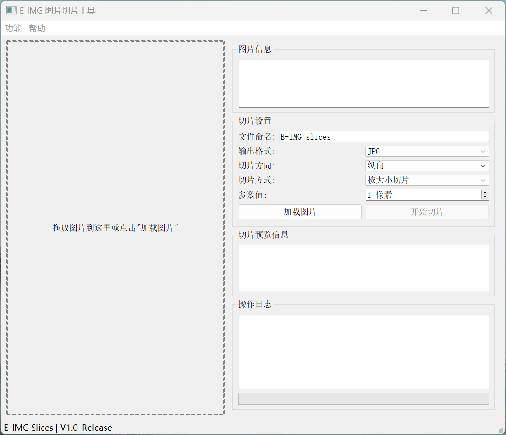

# E-IMG Slices

一个简单易用的图片切片工具

# ❓这是什么

如简介所述，这是一个“简单易用的图片切片工具”
不再需要推拉参考线只需要选择切片方向与方式,设置数值,导出即可
它的出现是为了省略工作上的一些繁琐步骤，虽然只是一小部分(谁不想早点下班呢？)
*重复的工作只会加速消磨我们的精力，把有限的时间精力放在更有趣的事情上*

# 💿快速安装

您可使用下述任意方式将此程序安装到您的设备上（仅适用于Windows）

- **使用打包好的版本（推荐）**
> 1.下载最新发布版本
> 2.解压文件，将E-IMG Slices.exe至您常用位置(如无后缀名则为E-IMG Slices)  
> 3.双击打开即可使用（见下方"使用说明"）  
- **从源码运行（Windows）**
>  1.克隆或下载本项目
>  2.安装python运行环境👉[Python](https://www.runoob.com)(https://www.python.org/)
> 3.安装第三方库👉命令提示符执行:`pip install PyQt5 Pillow`
> 在项目所在文件夹下使用命令提示符执行`python main.py`运行程序

# 🔦界面预览

# ✨支持的功能
**此程序的最新版本已支持下述功能**
- 图片预览
- 横向/纵向切片
- 支持按大小/按数量的切片
- 单个切片大小/切片总数量设置

**🐛如果您遇到问题或有建议可提交Issue**

# 📃开源协议
本项目基于 GNU General Public License v3.0 协议开源
您可在遵守此开源协议的前提下自由使用此程序

# 📕项目使用的第三方库
*下述项目对应开源协议详见其项目仓库页*
- **PyQt5**
>   使用版本: 5.15.11
>   开源许可: GPL v3
>   项目主页: https://www.riverbankcomputing.com/software/pyqt/
- **Pillow**
>   使用版本: 11.2.1
>   开源许可: MIT-CMU
>   项目主页: https://python-pillow.github.io
